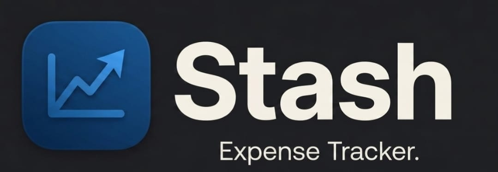
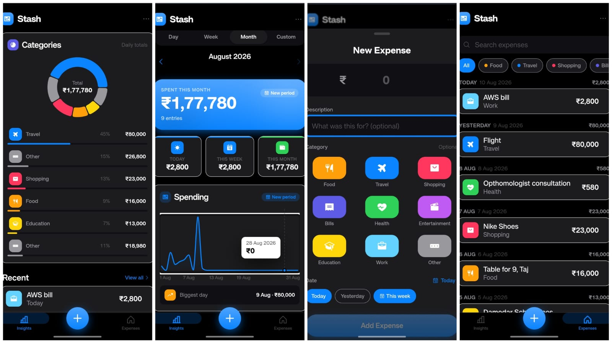

<div align="center">

<br>

<a href="https://tauhiddotexe.github.io/Stash/">
  
</a>

<br><br>

*Record spending in seconds. Understand your habits.*
*No accounts. No cloud. Your data stays on your device.*

<br>

[](https://react.dev/)
[](https://www.typescriptlang.org/)
[](https://vite.dev/)
[](https://tailwindcss.com/)
[](https://recharts.org/)
[](LICENSE.md)

<br>

[Live Demo](https://tauhiddotexe.github.io/Stash/) &nbsp;·&nbsp; [Report Bug](https://github.com/tauhiddotexe/Stash/issues) &nbsp;·&nbsp; [Request Feature](https://github.com/tauhiddotexe/Stash/issues)

</div>

<br>

---

<br>


<br>

<a href="https://tauhiddotexe.github.io/Stash/">
  
</a>

<br>

*The dashboard — your spending at a glance. Period total, quick summaries, trend chart, category breakdown, and recent expenses.*

<br>

<table>
<tr>
<td width="50%">
<a href="https://tauhiddotexe.github.io/Stash/">
  
</a>
</td>
<td width="50%" valign="top">

<br>

### ☀️🌙 &nbsp;Light & Dark

A seamless transition between themes.
Your choice is remembered.

<br>

### 🎨 &nbsp;Illustrated Empty States

Friendly visuals with clear calls to action — never a dead end.

<br>

### 🗑️ &nbsp;Thoughtful Deletion

Destructive actions ask twice. Your data stays yours.

</td>
</tr>
</table>

<br>

---

<br>


<br>

| | | |
|:---:|:---:|:---:|
| ⚡ | 📊 | 🥧 |
| **Add in Seconds** | **Smart Analytics** | **Category Breakdown** |
| Amount, description, category, date — in a fast bottom-sheet form | Adaptive trend chart, period comparison, biggest-day insight | Donut chart + legend with amounts & percentages |
| 🔍 | 🌗 | ♿ |
| **Search & Filter** | **Light + Dark + System** | **Accessible by Design** |
| Full-text search + category chips, grouped by date | Smooth crossfade toggle, persisted preference | Semantic HTML, ARIA, 44pt targets, ≥ 4.5:1 contrast |
| 📱 | 🔒 | ✈️ |
| **Mobile-First** | **Private & Local** | **Offline-Ready** |
| Optimized for phones, breathes on desktop | IndexedDB storage, no backend, no tracking | Works without internet after first load |

<br>

---

<br>


<br>

<div align="center">

```
Record          Analyze           Understand
   │                │                 │
   ▼                ▼                 ▼
┌─────────┐    ┌──────────┐    ┌──────────────┐
│  Open    │    │ Dashboard │    │  Trends &    │
│  Sheet   │───▶│ Updates   │───▶│  Categories  │
│  Enter   │    │ Instantly │    │  Reveal      │
│  Amount  │    │           │    │  Insights    │
└─────────┘    └──────────┘    └──────────────┘
```

</div>

<br>

---

<br>


<br>

| Concern | Choice |
| :--- | :--- |
| Framework | React 19 + TypeScript 7 |
| Build Tool | Vite 8 |
| Styling | Tailwind CSS v4 (`@tailwindcss/vite`) |
| Charts | Recharts (area trend + donut breakdown) |
| Storage | IndexedDB behind a typed repository layer |
| State | React Context + hooks (no external state library) |
| Routing | Client-side tabs synced to `#hash` |
| Icons | Phosphor Icons (SVG, theme-adaptive) |
| Motion | CSS transitions + keyframe animations, respects `prefers-reduced-motion` |

<br>

---

<br>


<br>

Stash is a **client-side, local-first** application. There is no backend.

<br>

```
┌──────────────────────────────────────────┐
│              User Interface              │
│           React + TypeScript             │
├──────────────────────────────────────────┤
│            Application Layer             │
│      State + Business Logic              │
│      Validation + Calculations           │
├──────────────────────────────────────────┤
│              Data Layer                  │
│           IndexedDB Storage              │
└──────────────────────────────────────────┘
```

<br>

### Principles

- **Local First** — expense data lives on the device; the app works without a network
- **Single Source of Truth** — expense records are authoritative; all metrics are derived, never stored independently
- **Separation of Concerns** — UI → application logic → domain calculations → storage
- **Deterministic Calculations** — pure functions produce the same output for the same inputs

<br>

### State Management

| Provider | Responsibility |
| :--- | :--- |
| `ThemeProvider` | Light / dark / system theme, persisted, respects system preference |
| `ExpensesProvider` | Expense records + CRUD + memoized derived selectors |
| `UIProvider` | Sheet, alert, toast, haptics |

Derived values recompute with `useMemo` keyed on `expenses` — fast even as history grows to thousands of records.

<br>

### Data & Privacy

- **No backend** — expense records never leave the device
- **No tracking** — no analytics, ads, or external requests
- **No secrets** — no API keys in client-side code
- **Input validation** — all user input validated before storage
- **XSS prevention** — descriptions render as plain text; no `dangerouslySetInnerHTML`
- **Safe deletion** — destructive actions require confirmation and target by unique ID

<br>

---

<br>


<br>

### Prerequisites

- [Node.js](https://nodejs.org/) ≥ 18
- [npm](https://www.npmjs.com/) ≥ 9 (or pnpm / yarn)

<br>

### Installation

```bash
# Clone the repository
git clone https://github.com/tauhiddotexe/Stash.git
cd Stash

# Install dependencies
npm install

# Start the development server
npm run dev
```

The app will be available at `http://localhost:5173`.

<br>

### Build for Production

```bash
npm run build      # TypeScript check + production build to /dist
npm run preview    # Preview the production build locally
```

<br>

### Project Structure

```
Stash/
├── docs/
│   └── pics/                   # UI screenshots & branding
├── public/                     # Static assets
├── src/
│   ├── components/
│   │   ├── ui/                 # Shared primitives (Button, Card, Sheet, Alert, Toast, ...)
│   │   ├── dashboard/          # DashboardPage, TrendChart, CategoryBreakdown, RecentExpenses
│   │   ├── expense/            # ExpenseForm, ExpenseListItem, CalendarPicker, CategoryPicker
│   │   └── expenses/           # ExpensesPage
│   ├── hooks/                  # useResolvedColors, useStagger
│   ├── lib/
│   │   ├── db/                 # IndexedDB repository layer
│   │   ├── dates.ts            # Date utilities (timezone-safe)
│   │   ├── calc.ts             # Pure domain calculations
│   │   ├── format.ts           # INR formatting
│   │   ├── validation.ts       # Form validation rules
│   │   ├── motion.ts           # Animation config
│   │   └── categories.ts       # Category definitions
│   ├── state/                  # React Context providers (expenses, theme, ui)
│   ├── types/                  # TypeScript type definitions
│   ├── AppShell.tsx            # Root layout, header, tab bar, sheets
│   ├── App.tsx                 # App entry composition
│   ├── main.tsx                # React DOM entry point
│   └── index.css               # Design tokens, base styles, animations
├── CONTRIBUTING.md
├── LICENSE.md
├── package.json
├── tsconfig.json
└── vite.config.ts
```

<br>

---

<br>


<br>

| Feature | Description |
| :--- | :--- |
| **Budgets** | Set monthly/category budgets with progress indicators |
| **Recurring Expenses** | Auto-log repeating expenses (rent, subscriptions) |
| **Export / Import** | CSV export and import for data portability |
| **PWA Installation** | Installable app with offline reliability |
| **Cloud Backup** | Optional encrypted backup with authentication |
| **Multi-Currency** | Support for currencies beyond INR |
| **Receipt Capture** | Photo attachment / OCR for receipts |
| **Cross-Device Sync** | Synchronization across multiple devices |

<br>

---

<br>

We welcome contributions! Please see [CONTRIBUTING.md](CONTRIBUTING.md) for guidelines.

This project is licensed under the [MIT License](LICENSE.md).

<br>

---

<div align="center">

<sub>Built with attention to detail — because personal finance should feel personal.</sub>

</div>
